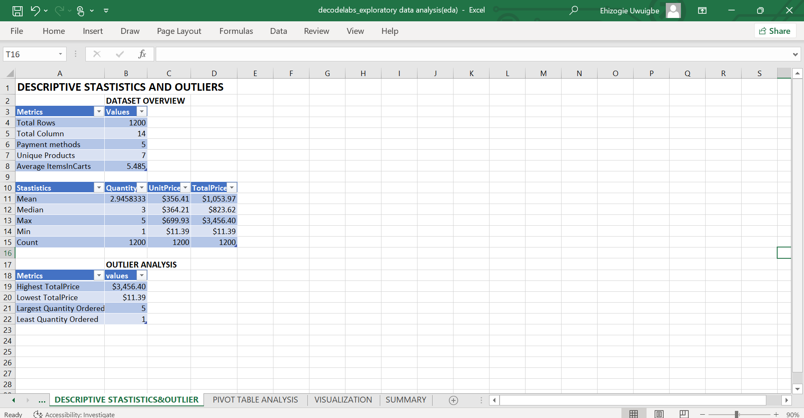
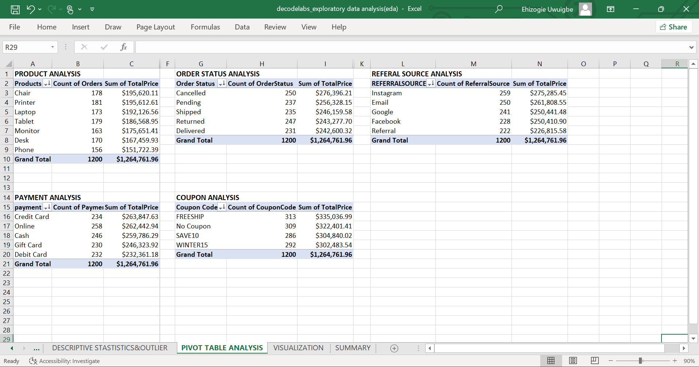
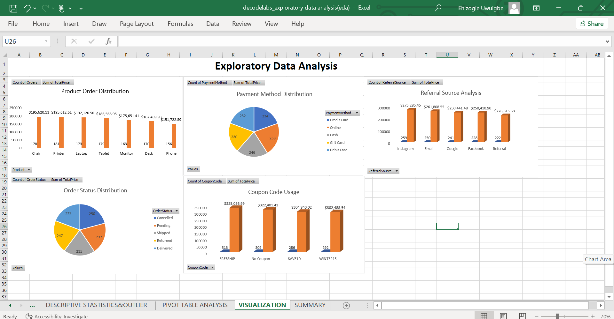
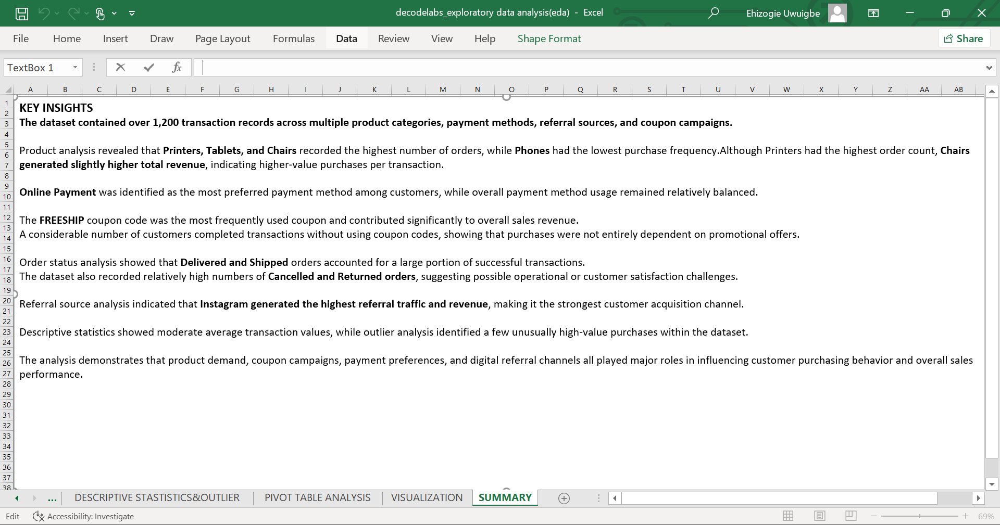

# decode-labs-exploratory-data-analysis
## Project Overview

This project focuses on performing Exploratory Data Analysis (EDA) on an e-commerce transaction dataset. The objective was to explore customer purchasing behavior, product performance, payment preferences, coupon usage, referral channels, and overall sales performance.
The analysis was conducted using Microsoft Excel through descriptive statistics, pivot tables, charts, and outlier analysis.

## Dataset Description
The dataset contains approximately 1,200 transaction records and includes the following fields:
- OrderID
- Date
- CustomerID
- Product
- Quamtity
- UnitPrice
- ShippingAddress
- PaymentMethod
- orderStatus
- TrackingNumber
- ItemsInCart
- CouponCode
- ReferralSource
- TotalPrice

  ---

  ## Objectives
  The analysis aimed to answer the following business questions:
- Which products generated the most revenue?
- Which products received the highest number of orders?
- Which payment methods were preferred by customers?
- Which coupon campaigns were most effective?
- Which referral channels generated the most traffic and revenue?
- Are there unusual transaction values within the dataset?

---

## Analytical Technique Used
### Descriptive Statistics

Descriptive statistics were performed to understand the distribution of transaction-related variables.

Metrics analyzed included:

- Mean
- Median
- Minimum
- Maximum
- Standard Deviation

---

### Pivot Table Analysis

Pivot tables were used to analyze:

- Product performance
- Revenue generation
- Payment methods
- Coupon code usage
- Referral source performance
- Order status distribution

---

### Outlier Analysis

Outlier analysis was conducted on transaction values to identify unusually high-value purchases that could influence overall business performance.

---

### Data Visualization

Charts were created to visualize:

- Product performance
- Revenue trends
- Payment method distribution
- Coupon effectiveness
- Referral source contribution
- Order status distribution

---

## Descriptive Statistics Findings

- The dataset contains **1,200 transaction records** and **14 columns**, providing a comprehensive view of customer purchasing behavior and sales performance.

- A total of **7 unique product categories** and **5 payment methods** were identified within the dataset.

- Customers purchased an average of approximately **5.49 items per cart**, indicating moderate shopping basket sizes.

- The average quantity purchased per transaction was approximately **2.95 units**, while the median quantity purchased was **3 units**.

- The average product unit price was approximately **$356.41**, while the median unit price was **$364.21**.

- The average transaction value was approximately **$1,053.97**, while the median transaction value was **$823.62**.

- Transaction values ranged from **$11.39** to **$3,456.40**, indicating significant variation in customer spending behavior.

- The highest transaction value (**$3,456.40**) was considerably higher than the average transaction value, suggesting the presence of high-value purchases within the dataset.

- Quantity purchased per transaction ranged from **1 to 5 units**.

---

## Pivot Table Analysis Findings

### Product Analysis

- **Printers recorded the highest number of orders (181)**, followed closely by Tablets (179) and Chairs (178).

- **Phones recorded the lowest number of orders (156)** among all product categories.

- Although Printers had the highest order volume, **Chairs generated the highest revenue ($195,620.11)**, indicating higher-value purchases per transaction.

### Payment Method Analysis

- **Online Payment was the most preferred payment method (258 transactions)** and contributed **$262,442.94** in revenue.

- Payment method usage remained relatively balanced across all available payment options.

### Coupon Analysis

- **FREESHIP was the most frequently used coupon code (313 transactions)** and generated the highest revenue (**$335,036.99**).

- Customers also completed **309 transactions without using any coupon code**, generating **$322,401.41** in revenue.

### Order Status Analysis

- **Cancelled orders recorded the highest transaction count (250 orders)** and generated **$276,396.21** in revenue.

- Delivered orders accounted for **231 transactions**, representing the lowest transaction count among order statuses.

### Referral Source Analysis

- **Instagram generated the highest referral traffic (259 orders)** and the highest revenue (**$275,285.45**).

- Referral traffic was relatively balanced across all channels, although Referral generated the lowest revenue (**$226,815.58**).

---

## Key Business Insights

- Product demand was concentrated among **Printers, Tablets, and Chairs**, making them the strongest-performing product categories.

- Customer purchasing behavior was not entirely dependent on promotional campaigns, as a significant number of transactions were completed without coupon codes.

- The **FREESHIP campaign** demonstrated strong customer adoption and revenue contribution.

- **Instagram proved to be the most effective customer acquisition channel**, generating both the highest order volume and revenue.

- High-value transactions contributed significantly to overall revenue performance and may represent premium customer purchasing behavior.

- The high number of Cancelled and Returned orders suggests potential opportunities to improve operational efficiency and customer satisfaction.

- Product demand, payment preferences, coupon campaigns, referral channels, and order fulfillment performance all played important roles in influencing overall sales performance.

---

## Recommendations

- Increase marketing investment in **Instagram**, as it delivers the highest customer acquisition and revenue.

- Continue optimizing the **FREESHIP** campaign due to its strong performance and customer adoption.

- Investigate the causes of Cancelled and Returned orders to improve customer satisfaction and operational efficiency.

- Focus inventory planning and promotional efforts on **Printers, Tablets, and Chairs** due to their strong performance.

- Monitor high-value transactions to better understand premium customer purchasing behavior and revenue drivers.

- Analyze purchasing patterns among customers who buy without coupons to identify opportunities for increasing full-price sales.

  ## Analysis Outputs

### Descriptive Statistics & Outlier Analysis

### Pivot Table Analysis

### Data Visualizations

### Summary Page

---

## Project Files

### EDA Workbook

- [Download EDA Workbook](decodelabs_exploratory_data_analysis(eda).xlsx)
  
 

  

  
  

---

  
